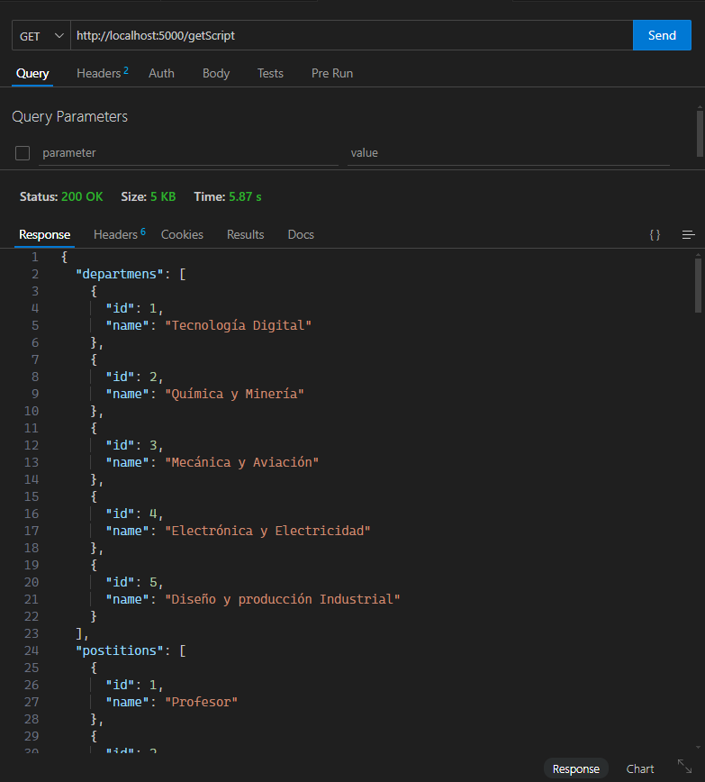
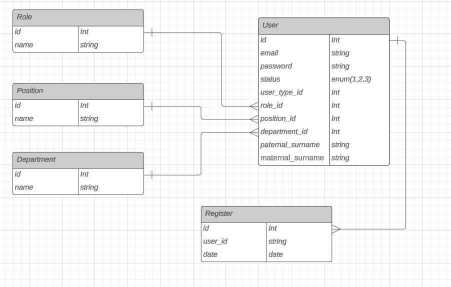

<h1 align="center">Api del Sistema: "Registro de Ingreso y Salida de Personas con Reconocimiento Facial mediante IA"
</h1>


### Preview 

## Módulos

- Módulo de Usuarios
- Registros
- Cursos
- Departamentos

## Tecnologías

Este proyecto utiliza las siguientes tecnologías:

#### Backend
- Python 3.10.12 
- Flask 3.0.3
- Face recognition
- opencv-python
- MySQL
- Docker 26.1.3

## MER preview


## Cómo levantar el proyecto

1. Clona el repositorio.
```bash
git clone https://github.com/Duberly2004/Facial_Recognition
```
```bash
cd Facial_Recognition
```
```bash
cd Project_Api
```
2. Instala las dependencias con `pip install -r requirements.txt`.
```bash
pip install -r requirements.txt
```

6. Ejecuta el comando `python app.py` para iniciar el servidor de desarrollo.
```bash
python app.py
```
7. Visita `http://localhost:5000`.