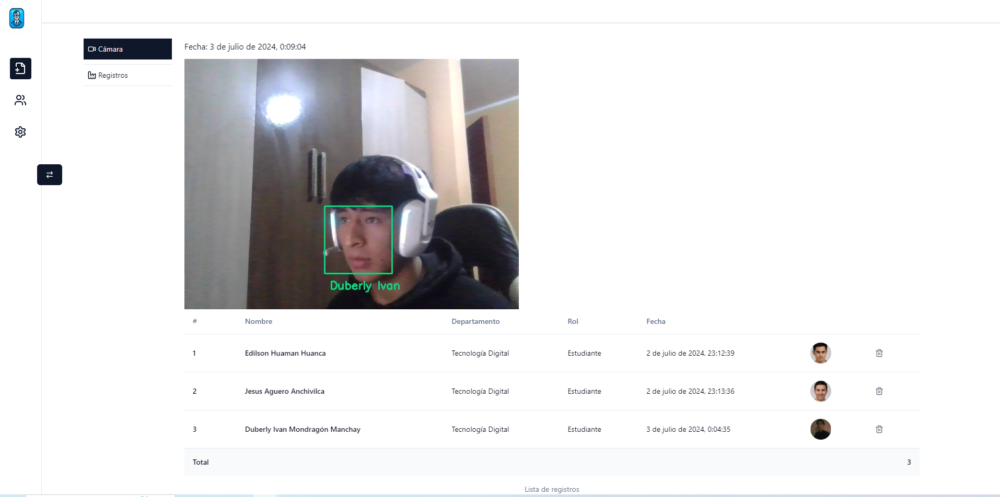
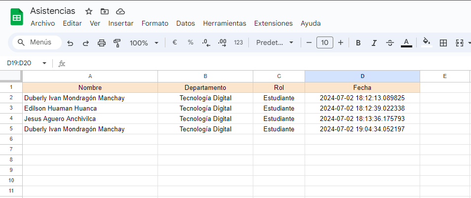

<h1 align="center">Sistema de control de asistencias con reconocimiento facial</h1>

## Preview Web


## Registro en exel


## Módulos

- Módulo de Usuarios
- Alumnos
- Profesores
- Asistencias
- Cursos

## Tecnologías

Este proyecto utiliza las siguientes tecnologías:

#### Frontend
- React 
- TypeScript
- React Query
- Tailwind CSS
- Shad CDN

#### Backend
- Python 3.10.12 
- Flask 3.0.3
- Face recognition
- opencv-python
- MySQL
- Docker 26.1.3

## Cómo levantar el proyecto

1. Clona el repositorio.
```bash
git clone https://github.com/Duberly2004/Facial_Recognition
```

Usa el readme de cada proyecto.